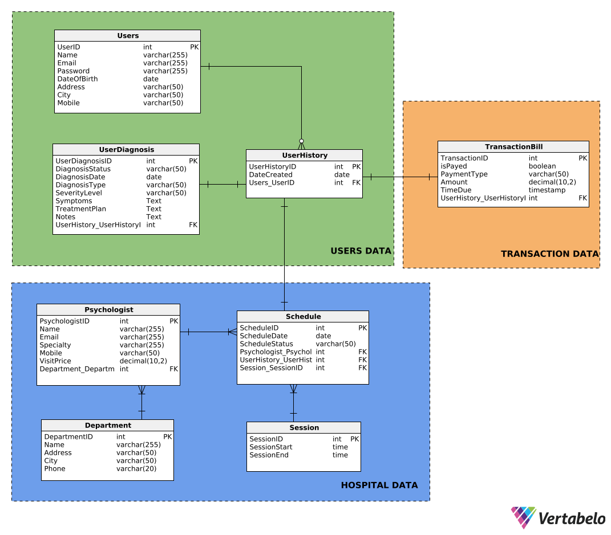

## WELCOME TO FINAL PROJECT MBD E

Silakan clone repo ini ke directory local

## HOW TO RUN SERVER

1. ketik `cd server` untuk masuk ke dir server
2. ketik `npm install`
3. setting database dulu dengan melihat petunjuk di `/server/.env`
4. ketik `npm start` pada terminal
5. happy collaboration

## HOW TO RUN CLIENT

To be Announced

1. ketik `cd client` untuk masuk ke dir client
2. ketik `npm install`
3. ketik `npm run serve` pada terminal
4. happy collaboration

Our Main Database Design:

