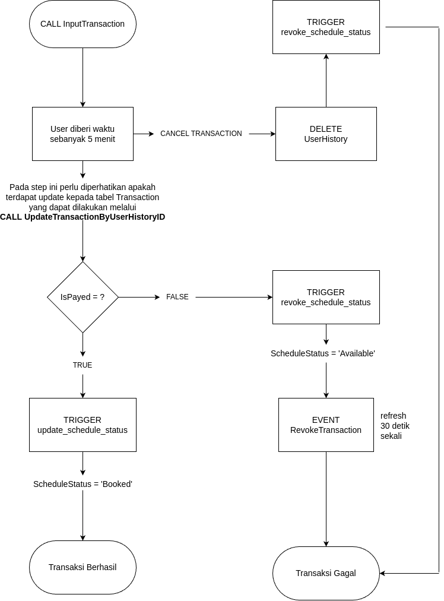

# Mekanisme QUERY Transaction



Query yang digunakan pada diagram tersebut adalah

1. `CALL InputTransaction(?, ?, ?);`
2. `CALL UpdateTransactionByUserHistoryID(?, ?);`
3. `DELETE FROM UserHistory WHERE UserHistoryID = ?;`

## 1. CALL InputTransaction(?, ?, ?);

```sql
CREATE PROCEDURE InputTransaction(
    IN User_UserID_input INT,
    IN ScheduleID_input INT,
    IN Amount_input FLOAT
)
BEGIN

    DECLARE setUserHistoryID INT;

    INSERT INTO UserHistory(User_UserID)
    VALUES(User_UserID_input);

    SET setUserHistoryID = LAST_INSERT_ID();

    INSERT INTO `Transaction`(Amount, User_UserID, UserHistory_UserHistoryID)
    VALUES(Amount_input, User_UserID_input, setUserHistoryID);

    UPDATE Schedule
    SET UserHistory_UserHistoryID = setUserHistoryID,
        ScheduleStatus = 'Waiting'
    WHERE ScheduleID = ScheduleID_input;

END;
```

### Parameter

1. `User_UserID_input`: Integer. ID pengguna yang melakukan transaksi.
2. `ScheduleID_input`: Integer. ID jadwal yang terkait dengan transaksi.
3. `Amount_input`: Float. Jumlah uang yang terlibat dalam transaksi.

### Langkah-Langkah

1. Membuat Entri UserHistory
2. Mendapatkan UserHistoryID Terbaru (LAST_INSERT ID)
3. Memasukkan Transaction
4. Memperbarui Jadwal (ScheduleStatus) dari default value 'Available' menjadi 'Waiting'

### Contoh Penggunaan

```sql
CALL InputTransaction(1, 4, 100000.00);
```

## 2. CALL UpdateTransactionByUserHistoryID(?, ?)

```sql
CREATE PROCEDURE UpdateTransactionByUserHistoryID(
    IN p_UserHistoryID INT,
    IN p_PaymentType INT
)
BEGIN
    UPDATE Transaction
    SET PaymentType = p_PaymentType,
        IsPayed = TRUE
    WHERE UserHistory_UserHistoryID = p_UserHistoryID;
END;
```

### Parameter

1. `p_UserHistoryID`: Integer. ID UserHistory yang akan digunakan untuk mencari transaksi yang terkait.
2. `p_PaymentType`: Integer. Jenis pembayaran baru yang akan diberikan untuk transaksi yang terkait.

### Langkah-Langkah

1. Memperbarui Transaksi `IsPayed = TRUE`
2. Berdasarkan `UserHistoryID`

### Contoh Penggunaan

```sql
CALL UpdateTransactionByUserHistoryID(3,2);
```

## DELETE FROM UserHistory (Cancel Transaction)

```sql
DELETE FROM UserHistory WHERE UserHistoryID = ? ;
```

Dapat digunakan untuk men-CANCEL booking transaction dengan men-DELETE UserHistory berdasarkan ID dari tabel tersebut.

### Contoh Penggunaan

```sql
DELETE FROM UserHistory WHERE UserHistoryID = 2
```
